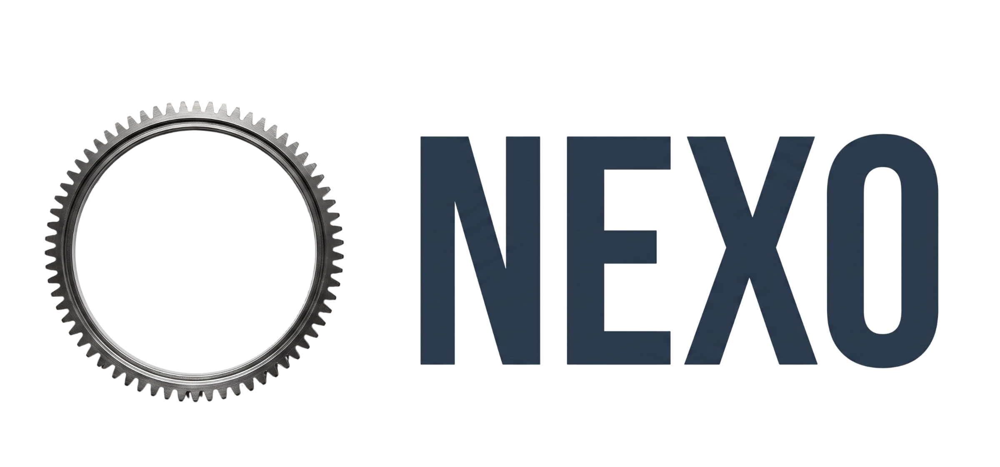

<p align="center">
  
</p>

<table align="center">
  <tr>
    <td bgcolor="#111111" align="center">
      
    </td>
  </tr>
</table>

# Nexo

Nexo es la plataforma interna de ECS Mobility para centralizar OEE y operativa de planta. Conecta con la BD MES, consolida los datos en una base local y permite explotar la informacion desde la web y mediante informes generados bajo demanda.

## Arranque rapido

```bash
make init
```

Este comando usa la imagen web local si ya existe, arranca Postgres, aplica el
schema `nexo.*` de forma idempotente y deja el stack completo (`db`, `web`,
`caddy`) con logs etiquetados por servicio. En desarrollo monta el codigo del
repo dentro del contenedor, asi ves templates y cambios actuales aunque no
reconstruyas la imagen. Pulsa `Ctrl+C` para parar los contenedores sin borrar
datos.

Para forzar reconstruccion:

```bash
NEXO_BUILD=1 make init
```

> **Servicio MCP aparcado en profile `mcp`**. `make up` y `make dev` ya **no** arrancan el contenedor `mcp`. Si necesitas el server MCP en Docker (p.ej. para inspeccion local desde Claude Code), arrancalo explicitamente con `docker compose --profile mcp up -d mcp`. El ID del servidor MCP pasa de `oee-planta` a `nexo-mcp` — si tienes `.claude.json` apuntando al ID antiguo, actualizalo (ver `mcp/README.md`).


