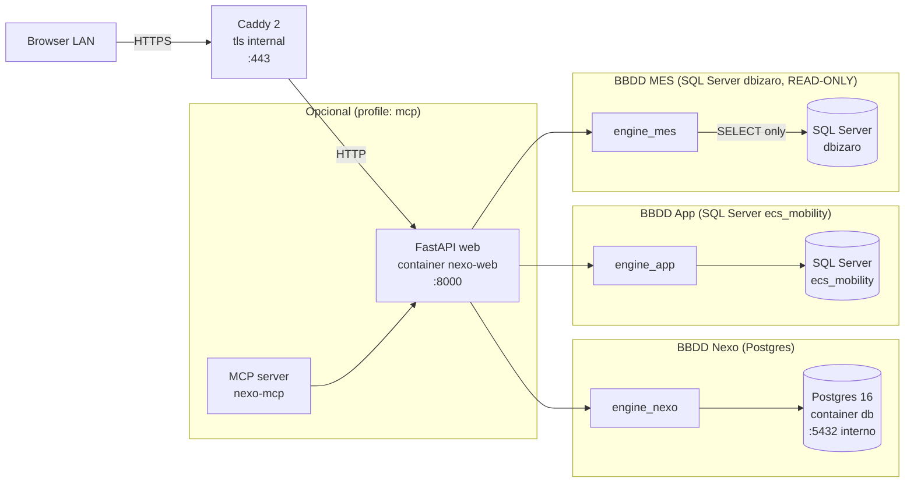

# ARCHITECTURE.md — Mapa tecnico de Nexo

> Para convenciones y reglas del juego, ver [CLAUDE.md](../CLAUDE.md).
> Para deploy en LAN, ver [DEPLOY_LAN.md](DEPLOY_LAN.md).
> Para incidencias runtime, ver [RUNBOOK.md](RUNBOOK.md).
> Para procedimiento de release, ver [RELEASE.md](RELEASE.md).

Ultima revision: 2026-04-22 (Sprint 6 / Phase 7).

Audiencia: dev o IA nuevo en el repo. Tras leer este doc + [CLAUDE.md](../CLAUDE.md)
deberias poder clonar, arrancar (`make up && make migrate && make nexo-owner`) y
empezar a trabajar sin pedir contexto al autor del modulo.

---

## 1. Que es Nexo

Plataforma interna de ECS Mobility. Web app FastAPI + Postgres 16 + dos SQL Server
separados. Sucesora del monolito "OEE Planta" manteniendo el mismo stack: cambio de
nombre y refactor estructural, no reescritura. Desplegada en LAN interna (Ubuntu
Server 24.04) con Caddy `tls internal`. Sin exposicion a internet.

Convenciones de naming, decisiones cerradas y politica de commits: ver
[CLAUDE.md](../CLAUDE.md).

---

## 2. Stack

| Capa              | Tecnologia                  | Version     | Notas                                                  |
|-------------------|-----------------------------|-------------|--------------------------------------------------------|
| Web framework     | FastAPI                     | 0.135.3     | Lifespan + middleware stack custom                     |
| Templating        | Jinja2                      | 3.1.6       | SSR; sin SPA                                           |
| Frontend          | Alpine.js + Tailwind (CDN)  | latest      | Sin build step                                         |
| ORM               | SQLAlchemy                  | 2.0.49      | 3 engines independientes                               |
| Postgres driver   | psycopg2-binary             | 2.9.11      | —                                                      |
| SQL Server driver | pyodbc                      | 5.3.0       | msodbcsql18                                            |
| Auth hashing      | argon2-cffi                 | 25.1.0      | argon2id (ver [AUTH_MODEL.md](AUTH_MODEL.md))          |
| Rate limit        | slowapi                     | 0.1.9       | In-memory, per-IP                                      |
| PDF gen           | matplotlib                  | 3.10.8      | Backend Agg                                            |
| DataFrame         | pandas                      | 3.0.2       | —                                                      |
| Runtime image     | python:3.11-slim-bookworm   | —           | Dockerfile                                             |
| Reverse proxy     | Caddy 2                     | 2-alpine    | `tls internal` en prod                                 |
| Postgres server   | postgres:16-alpine          | —           | Container `db`, volumen `pgdata`                       |
| Lint + format     | ruff                        | 0.15.11     | Consolidado (check + format) — Phase 7 / DEVEX-01      |
| Type checking     | mypy                        | 1.13.0      | Ligero; scoped `api/`+`nexo/`                          |
| Pre-commit        | pre-commit                  | 4.0.1       | Hooks en `.pre-commit-config.yaml`                     |

Runtime de CI: GitHub Actions sobre `ubuntu-24.04` con matriz `["3.11", "3.12"]`
para los jobs `lint` y `test` (ver [.github/workflows/ci.yml](../.github/workflows/ci.yml)).

---

## 3. Los 3 engines

Nexo habla con tres bases de datos distintas. Cada una tiene un engine SQLAlchemy
dedicado, con responsabilidad y credenciales separadas. Esto es el nucleo del
modelo de datos post-Phase 3.



### Responsabilidades por engine

| Engine          | BBDD                                 | Env vars        | Casos de uso                                                                                                   |
|-----------------|--------------------------------------|-----------------|----------------------------------------------------------------------------------------------------------------|
| `engine_nexo`   | Postgres 16 (schema `nexo.*`)        | `NEXO_PG_*`     | users, roles, permissions, sessions, login_attempts, audit_log, query_log, query_thresholds, query_approvals   |
| `engine_app`    | SQL Server `ecs_mobility`            | `NEXO_APP_*`    | cfg.recursos, cfg.ciclos, cfg.contactos, oee.*, luk4.*                                                         |
| `engine_mes`    | SQL Server `dbizaro` (READ-ONLY)     | `NEXO_MES_*`    | Partes de trabajo, turnos, recursos MES. El usuario SQL es de solo lectura por convencion                      |

**Regla de oro (Phase 3):** ningun router importa `pyodbc` directamente. Todas las
queries pasan por repositorios en `nexo/data/repositories/{app,mes,nexo}.py`, que
cargan SQL desde archivos `.sql` versionados en `nexo/data/sql/`.

El servicio MCP es opcional y esta detras de `profiles: ["mcp"]` en
`docker-compose.yml` — `make up` y `make dev` NO lo arrancan (decision cerrada
CLAUDE.md). Solo con `docker compose --profile mcp up`.

---

## 4. Layout del repo

```
analisis_datos/
|-- api/                    # FastAPI app
|   |-- main.py             # Lifespan + middleware registration
|   |-- config.py           # pydantic-settings (lee NEXO_*)
|   |-- database.py         # init_db legacy (ecs_mobility bootstrap)
|   |-- deps.py             # Dependencies (current_user, Jinja env)
|   |-- middleware/         # auth, audit
|   |-- routers/            # 25+ routers (pipeline, bbdd, auth, ...)
|   |-- services/           # Business logic (pipeline, email, ...)
|   +-- rate_limit.py       # slowapi limiter
|-- nexo/                   # Nueva capa (Phase 3+)
|   |-- data/
|   |   |-- engines.py      # engine_mes / engine_app / engine_nexo
|   |   |-- repositories/   # MesRepository, AppRepository, NexoRepository
|   |   |-- sql/            # Queries .sql versionadas + loader
|   |   |-- dto/            # DTOs inmutables (frozen dataclasses)
|   |   |-- models_app.py   # SQLAlchemy models ecs_mobility
|   |   |-- models_nexo.py  # SQLAlchemy models schema nexo
|   |   +-- schema_guard.py # Valida tablas nexo.* al arrancar
|   |-- middleware/         # flash, query_timing
|   +-- services/           # auth, approvals, preflight, pipeline_lock, ...
|-- OEE/                    # LEGACY — NO TOCAR en Mark-III
|   |-- disponibilidad/
|   |-- rendimiento/
|   |-- calidad/
|   +-- oee_secciones/
|-- templates/              # Jinja2 (base.html + 40 sub-templates)
|-- static/                 # CSS, JS, imagenes brand (ver BRANDING.md)
|-- scripts/                # init_nexo_schema.py, deploy.sh, backup_nightly.sh
|-- tests/                  # pytest (auth/ data/ routers/ infra/ ...)
|-- caddy/                  # Caddyfile + Caddyfile.prod
|-- docs/                   # Fuente de verdad humana (planes, audits, runbooks)
|-- .planning/              # Runtime GSD (no editar a mano — ver CLAUDE.md)
|-- Dockerfile              # Python 3.11-slim + msodbcsql18
|-- docker-compose.yml      # Base: db + web + caddy + mcp (profile)
|-- docker-compose.prod.yml # Override prod (Phase 6)
|-- Makefile                # dev/prod/devex targets
+-- pyproject.toml          # Config ruff + mypy + pytest + coverage (Phase 7)
```

---

## 5. Flujo de una request

```
Browser -> Caddy (TLS) -> web container (:8000) -> ...
  -> FastAPI Exception Handler (captura 500 + envuelve con error_id UUID)
  -> AuthMiddleware (valida session cookie, setea request.state.user)
  -> FlashMiddleware (lee/limpia nexo_flash cookie para UX toast)
  -> AuditMiddleware (escribe a nexo.audit_log tras la response)
  -> QueryTimingMiddleware (mide + loguea slow queries a nexo.query_log)
  -> Router (ej. api.routers.pipeline.run)
  -> Service layer (ej. api.services.pipeline.run_pipeline)
  -> Repository (ej. nexo.data.repositories.mes.MesRepository)
  -> Engine (engine_mes / engine_app / engine_nexo)
```

### Orden del middleware stack

Verificado en `api/main.py` (orden de `app.add_middleware` — FastAPI ejecuta el
ULTIMO registrado primero; o sea, el outer es el que se `add_middleware`-a al final):

1. **AuthMiddleware** (outer) — 401 si no hay sesion valida, salvo `/login`,
   `/static/`, `/api/health`. Ver [AUTH_MODEL.md](AUTH_MODEL.md).
2. **FlashMiddleware** — lee y borra `nexo_flash` cookie, inyecta en response.
3. **AuditMiddleware** — registra cada request + user + path + status en
   `nexo.audit_log` (append-only).
4. **QueryTimingMiddleware** (inner) — mide `actual_ms`, compara con threshold,
   loguea a `nexo.query_log` si `actual_ms > warn_ms * 1.5`.

Orden literal en codigo (`api/main.py:298-301`):

```python
app.add_middleware(QueryTimingMiddleware)  # innermost - ultima capa antes del handler
app.add_middleware(AuditMiddleware)        # inner - segundo en ejecutar
app.add_middleware(FlashMiddleware)        # Plan 05-03 - entre Audit y Auth
app.add_middleware(AuthMiddleware)         # outer - primero en ejecutar
```

---

## 6. Schedulers (lifespan tasks)

Tres tasks asyncio arrancadas en `lifespan` (`api/main.py`):

| Task                                              | Origen              | Cadencia                            | Funcion                                                     |
|---------------------------------------------------|---------------------|-------------------------------------|-------------------------------------------------------------|
| `thresholds_cache` listener                       | Phase 4 / Plan 04-04| LISTEN/NOTIFY + safety-net 5 min    | Refresca cache cuando `/ajustes/limites` CRUD dispara NOTIFY|
| `cleanup_scheduler` -> `approvals_cleanup`        | Phase 4 / Plan 04-03| Lunes 03:05 UTC                     | Purga approvals expirados (TTL 7d)                          |
| `cleanup_scheduler` -> `query_log_cleanup`        | Phase 4 / Plan 04-04| Lunes 03:00 UTC                     | Retencion 90d de `nexo.query_log`                           |
| `cleanup_scheduler` -> `factor_auto_refresh`      | Phase 4 / Plan 04-04| 1er lunes del mes 03:10 UTC         | Recalcula factor si estancado > 60d                         |

Todos los jobs escriben audit log con `path='__<job_name>__'`.

---

## 7. Deployment

Deploy productivo LAN: ver [DEPLOY_LAN.md](DEPLOY_LAN.md) (740 lineas, 16 secciones).

Resumen operativo:
- `make prod-up` arranca el stack con `docker-compose.prod.yml`.
- Hostname `nexo.ecsmobility.local` (ver `caddy/Caddyfile.prod` y entrada hosts-file).
- Caddy `tls internal` con root CA interna distribuida manualmente a clientes LAN.
- `ufw default deny incoming` + allow 22/80/443.
- Cron diario con `backup_nightly.sh` (retencion 7d en `/var/backups/nexo/`).

Para el procedimiento de corte de release (tags, CHANGELOG, smoke post-deploy),
ver [RELEASE.md](RELEASE.md).

---

## 8. Enlaces rapidos

- [CLAUDE.md](../CLAUDE.md) — reglas de juego para IAs/devs, decisiones cerradas
- [AUTH_MODEL.md](AUTH_MODEL.md) — roles, departamentos, lockout progresivo
- [BRANDING.md](BRANDING.md) — assets + variables de marca
- [GLOSSARY.md](GLOSSARY.md) — terminos de dominio (Nexo, MES, APP, preflight)
- [DEPLOY_LAN.md](DEPLOY_LAN.md) — runbook deploy LAN completo
- [RUNBOOK.md](RUNBOOK.md) — 5 escenarios de incidencia runtime
- [RELEASE.md](RELEASE.md) — checklist release versionado con semver
- [SECURITY_AUDIT.md](SECURITY_AUDIT.md) — historial de credenciales expuestas
- [CURRENT_STATE_AUDIT.md](CURRENT_STATE_AUDIT.md) — foto fija del repo al arrancar Mark-III
- [MARK_III_PLAN.md](MARK_III_PLAN.md) — plan de los 7 sprints con entregables

---

## 9. Si tocas algo estructural, actualiza esto

Si anyades un 4to engine, cambias el orden del middleware stack, introduces un
scheduler nuevo en `lifespan`, o mueves carpetas del layout, actualiza esta pagina
en el MISMO PR que el cambio. ARCHITECTURE.md drift es peor que ARCHITECTURE.md
ausente: un doc que miente guia al siguiente dev en direccion equivocada durante
horas.

Si detectas que este doc ha divergido del repo real (ej. `grep engine_` devuelve
algo que no esta aqui), abre issue o — mejor — edita el doc en el commit del PR
que introdujo el drift.
